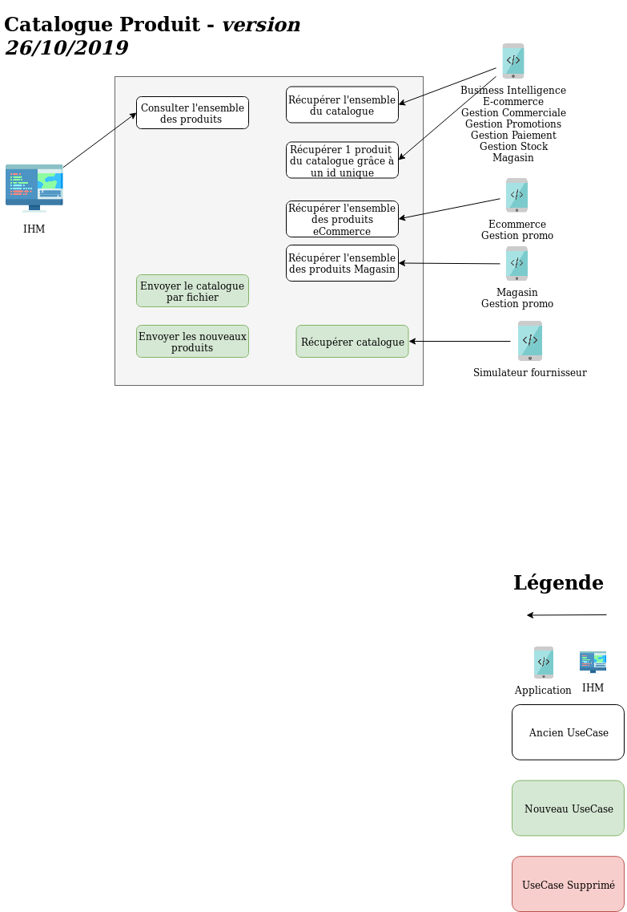

[Sommaire](https://ursi-2020.github.io/Documentation/)

*[API](api.md)*

# Rôle de l'application

Le rôle du catalogue produit est de récuperer les informations produits depuis les différents fournisseurs pour pouvoir les redistribuer dans le système d'information.

# Use Case

*[Anciennes versions des Uses Cases](use-case.md)*
## Sprint 2 (26/10/2019):

# Membres du groupe

* Esteban Casanas
* Jean-Baptiste Roland
* Alexandre Guedj
* Louis Bonnafous
