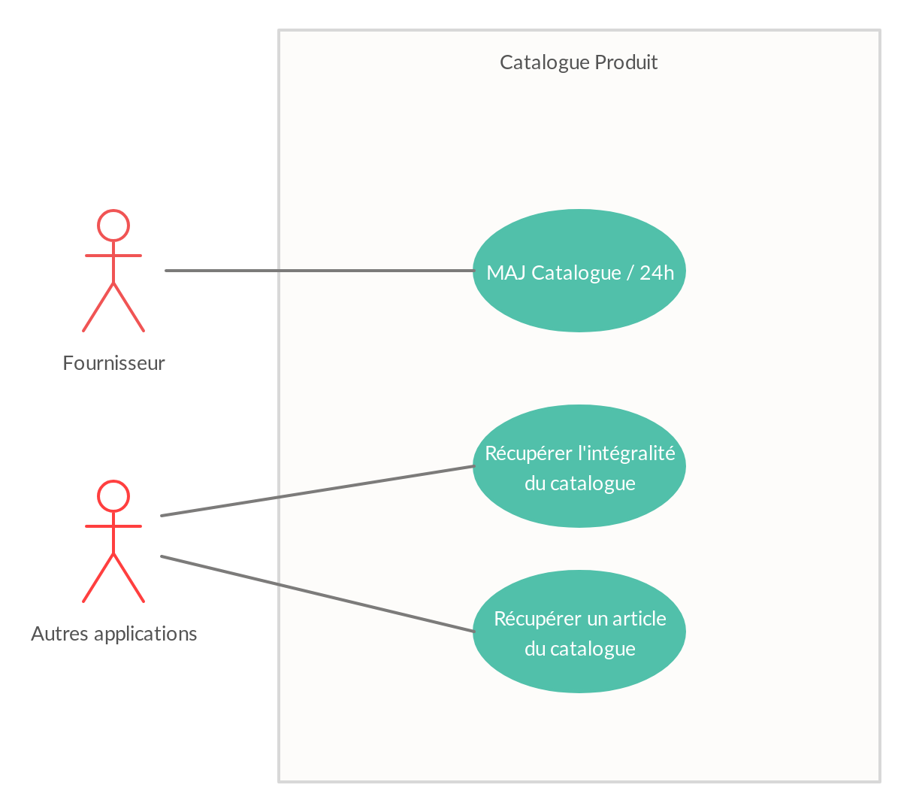
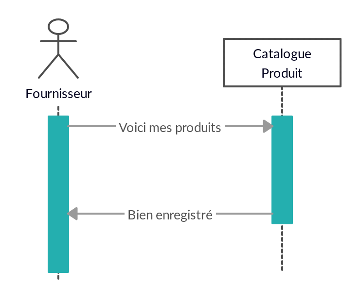
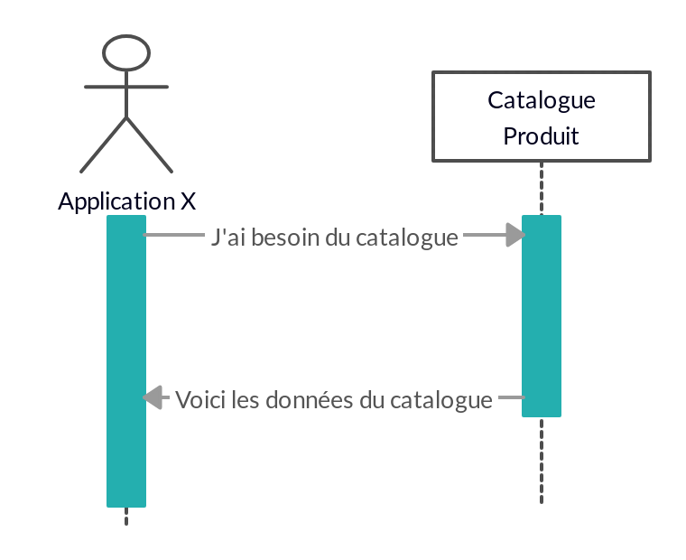

[Sommaire](https://ursi-2020.github.io/catalogue-produits/)
# Use Case Catalogue Produits
Le catalogue produit est le référentiel des différents articles qui seront utilisés dans tout le SI. Voici les différents use cases qui seront implémentés.


## Mise à jour du catalogue par le fournisseur
Il y a 2 façons pour le fournisseur de mettre à jour le catalogue : automatiquement via le scheduler, ou manuellement via le chargement d'un fichier.



### Automatique

Le chargement automatique peut être activé via l'IHM avec le bouton *Activer le scheduler*. Il programme le chargement du fichier stocké au path suivant : **./tests/data.json**.
Ce fichier doit être au format JSON.
Ce chargement se fait de manière recurrente, toutes les minutes (pour faciliter la démonstration). Il sera plus tard réglé pour une fréquence journalière.

### Manuel

Le chargement manuel se fait via l'IHM, avec le bouton *Charger le fichier de données*. Le fichier doit être au format JSON.


## Récupérer les données du catalogue
Les différentes applications du SI ont besoin de recueillir les informations produits pour divers usages. Le catalogue expose donc une route API permettant de récuperer ces données au format JSON.



### Récupérer l'intégralité du catalogue

Un appel à la route /api/data permet de récupérer l'intégralité du catalogue sous la forme d'un JSON. Voici un exemple de réponse :
```json
{
    produits: [
        {
            id : 1,
            codeProduit: "X1-0",
            descriptionProduit: "Frigos:P1-0",
            familleProduit : "Frigos",
            packaging : 2,
            prix : 424,
            quantiteMin : 15
        },
        {
            id : 2,
            codeProduit: "X1-1",
            descriptionProduit: "TV:P1-0",
            familleProduit : "Télévision",
            packaging : 4,
            prix : 1625,
            quantiteMin : 25
        },
    ]
}
```
Plus de détails ici : [Référence API](api.md)

### Récupérer un produit en particulier

Un appel à la route /api/data permet avec un id particulier permet de le récupérer. Voici un exemple de réponse pour id = 1:

```json
{
    produit: {
            id : 1,
            codeProduit: "X1-0",
            descriptionProduit: "Frigos:P1-0",
            familleProduit : "Frigos",
            packaging : 2,
            prix : 424,
            quantiteMin : 15
    }
}
```

Plus de détails ici : [Référence API](api.md)